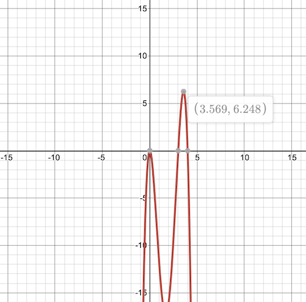

# An Evolutionary Algorithm to solve a simple function maximization problem

## Sample Function:
\[ f(x) = -2x^2(x-3)(x-4) \]

## Concepts:
1. Generate an initial population of individuals randomly.
2. Evaluate the fitness of each individual in the population with a given fitness function.
3. Repeat the following algorithm until termination:
    * Select the best individuals for producing offsprings.
    * Mutate those offsprings.
    * Merge the offsprings to the initial population and evaluate the individual fitness of new individuals.
    * Remove individuals with low fitness scores.
4. Select the individual with the highest score as the final solution.

## Questions:
1. What are the individuals?
2. Population size and how to generate the individuals?
3. How to evaluate a fitness score?
4. How to produce and mutate offsprings?
5. How many individuals die?
6. How many epochs will we repeat?

## Answers:
1. The individuals are solutions to given problems. In the beginning, a set of random individuals form an initial population.
2. Population size is a hyperparameter that can be a random number. A former experiment executed with different population sizes from 2 to 8 and showed that the population size, which is more than 2, is better.
3. By using a given fitness function to evaluate the individual fitness. Depending on a problem, different fitness functions can adopt instead.
4. In this experiment, there are two ways to generate offspring. One way is using two individuals and offspring is the mean of them. Another way is to select two individuals and pick the individual with a higher fitness score.
5. As many as possible. It would be a wise choice to keep the new size as same as the initial population size.
6. As many as possible.

## Result
Execute the experiment in 20 epochs and see how the algorithm evolved.
```
Epoch 0: ['x: 4.249 => y: -11.214', 'x: 2.542 => y: -8.627', 'x: 2.698 => y: -5.730', 'x: 2.732 => y: -5.073', 'x: 0.528 => y: -4.793', 'x: 3.209 => y: 3.399', 'x: 3.396 => y: 5.515', 'x: 3.568 => y: 6.248']
Epoch 1: ['x: 0.528 => y: -4.793', 'x: 3.952 => y: 1.421', 'x: 3.153 => y: 2.570', 'x: 3.209 => y: 3.399', 'x: 3.223 => y: 3.597', 'x: 3.396 => y: 5.515', 'x: 3.425 => y: 5.736', 'x: 3.568 => y: 6.248']
Epoch 2: ['x: 3.952 => y: 1.421', 'x: 3.153 => y: 2.570', 'x: 3.209 => y: 3.399', 'x: 3.223 => y: 3.597', 'x: 3.396 => y: 5.515', 'x: 3.425 => y: 5.736', 'x: 3.557 => y: 6.244', 'x: 3.568 => y: 6.248']
Epoch 3: ['x: 3.153 => y: 2.570', 'x: 3.155 => y: 2.607', 'x: 3.209 => y: 3.399', 'x: 3.223 => y: 3.597', 'x: 3.396 => y: 5.515', 'x: 3.425 => y: 5.736', 'x: 3.557 => y: 6.244', 'x: 3.568 => y: 6.248']
Epoch 4: ['x: 3.153 => y: 2.570', 'x: 3.155 => y: 2.607', 'x: 3.209 => y: 3.399', 'x: 3.223 => y: 3.597', 'x: 3.396 => y: 5.515', 'x: 3.425 => y: 5.736', 'x: 3.557 => y: 6.244', 'x: 3.568 => y: 6.248']
Epoch 5: ['x: 3.223 => y: 3.597', 'x: 3.280 => y: 4.342', 'x: 3.396 => y: 5.515', 'x: 3.425 => y: 5.736', 'x: 3.688 => y: 5.839', 'x: 3.614 => y: 6.191', 'x: 3.557 => y: 6.244', 'x: 3.568 => y: 6.248']
Epoch 6: ['x: 3.280 => y: 4.342', 'x: 3.396 => y: 5.515', 'x: 3.425 => y: 5.736', 'x: 3.688 => y: 5.839', 'x: 3.685 => y: 5.863', 'x: 3.614 => y: 6.191', 'x: 3.557 => y: 6.244', 'x: 3.568 => y: 6.248']
Epoch 7: ['x: 3.423 => y: 5.718', 'x: 3.425 => y: 5.736', 'x: 3.688 => y: 5.839', 'x: 3.685 => y: 5.863', 'x: 3.614 => y: 6.191', 'x: 3.603 => y: 6.215', 'x: 3.557 => y: 6.244', 'x: 3.568 => y: 6.248']
Epoch 8: ['x: 3.425 => y: 5.736', 'x: 3.688 => y: 5.839', 'x: 3.685 => y: 5.863', 'x: 3.513 => y: 6.168', 'x: 3.614 => y: 6.191', 'x: 3.603 => y: 6.215', 'x: 3.557 => y: 6.244', 'x: 3.568 => y: 6.248']
Epoch 9: ['x: 3.688 => y: 5.839', 'x: 3.685 => y: 5.863', 'x: 3.478 => y: 6.037', 'x: 3.513 => y: 6.168', 'x: 3.614 => y: 6.191', 'x: 3.603 => y: 6.215', 'x: 3.557 => y: 6.244', 'x: 3.568 => y: 6.248']
Epoch 10: ['x: 3.478 => y: 6.037', 'x: 3.651 => y: 6.058', 'x: 3.487 => y: 6.074', 'x: 3.513 => y: 6.168', 'x: 3.614 => y: 6.191', 'x: 3.603 => y: 6.215', 'x: 3.557 => y: 6.244', 'x: 3.568 => y: 6.248']
Epoch 11: ['x: 3.651 => y: 6.058', 'x: 3.487 => y: 6.074', 'x: 3.513 => y: 6.168', 'x: 3.614 => y: 6.191', 'x: 3.603 => y: 6.215', 'x: 3.589 => y: 6.236', 'x: 3.557 => y: 6.244', 'x: 3.568 => y: 6.248']
Epoch 12: ['x: 3.651 => y: 6.058', 'x: 3.487 => y: 6.074', 'x: 3.513 => y: 6.168', 'x: 3.614 => y: 6.191', 'x: 3.603 => y: 6.215', 'x: 3.589 => y: 6.236', 'x: 3.557 => y: 6.244', 'x: 3.568 => y: 6.248']
Epoch 13: ['x: 3.651 => y: 6.058', 'x: 3.487 => y: 6.074', 'x: 3.513 => y: 6.168', 'x: 3.614 => y: 6.191', 'x: 3.603 => y: 6.215', 'x: 3.589 => y: 6.236', 'x: 3.557 => y: 6.244', 'x: 3.568 => y: 6.248']
Epoch 14: ['x: 3.651 => y: 6.058', 'x: 3.487 => y: 6.074', 'x: 3.513 => y: 6.168', 'x: 3.614 => y: 6.191', 'x: 3.603 => y: 6.215', 'x: 3.589 => y: 6.236', 'x: 3.557 => y: 6.244', 'x: 3.568 => y: 6.248']
Epoch 15: ['x: 3.651 => y: 6.058', 'x: 3.487 => y: 6.074', 'x: 3.513 => y: 6.168', 'x: 3.614 => y: 6.191', 'x: 3.603 => y: 6.215', 'x: 3.589 => y: 6.236', 'x: 3.557 => y: 6.244', 'x: 3.568 => y: 6.248']
Epoch 16: ['x: 3.651 => y: 6.058', 'x: 3.487 => y: 6.074', 'x: 3.513 => y: 6.168', 'x: 3.614 => y: 6.191', 'x: 3.603 => y: 6.215', 'x: 3.589 => y: 6.236', 'x: 3.557 => y: 6.244', 'x: 3.568 => y: 6.248']
Epoch 17: ['x: 3.487 => y: 6.074', 'x: 3.513 => y: 6.168', 'x: 3.614 => y: 6.191', 'x: 3.603 => y: 6.215', 'x: 3.589 => y: 6.236', 'x: 3.557 => y: 6.244', 'x: 3.558 => y: 6.245', 'x: 3.568 => y: 6.248']
Epoch 18: ['x: 3.487 => y: 6.074', 'x: 3.513 => y: 6.168', 'x: 3.614 => y: 6.191', 'x: 3.603 => y: 6.215', 'x: 3.589 => y: 6.236', 'x: 3.557 => y: 6.244', 'x: 3.558 => y: 6.245', 'x: 3.568 => y: 6.248']
Epoch 19: ['x: 3.490 => y: 6.089', 'x: 3.513 => y: 6.168', 'x: 3.614 => y: 6.191', 'x: 3.603 => y: 6.215', 'x: 3.589 => y: 6.236', 'x: 3.557 => y: 6.244', 'x: 3.558 => y: 6.245', 'x: 3.568 => y: 6.248']
```
Compare the final result with the global maximum of the graph function to evaluate the algorithm performance.

